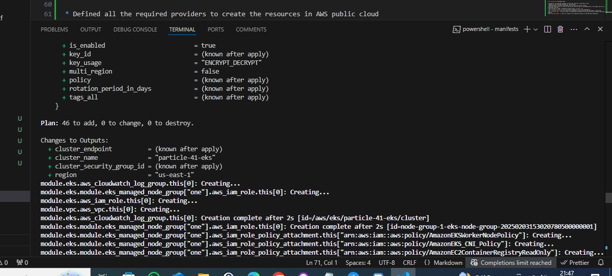

# particle41-interview
Partciel41 interview solution

# Author - Sree Satya Sitaram Narpareddi

The solution has been broken into 4 parts

* Write the application code in Nodejs using expressjs
* Create a Dockerfile to containerize the application
* Create terraform code to create required infrastructure
* Deploy the application to the EKS cluster and test the load balancer dns.

**Additionally screenshots have been added**

# Application code

* Created a folder app to store all the application code here
* Created an index.js file
* launch a terminal to install all the requirements for the application to run
* Run `npm init` -> this will instantiate the node package manager and create `package.json` file and this will store all the required application data.
* Run `npm install express` -> This will install the required dependencies for our application
* Once the application is ready, we can run the application locally to test the same.
* Run `node index.js` to start the application
* Check `localhost:3000`, we should be able to see the application

Pictures/Screenshots

# Containerizing the application

* Create a `Dockerfile` in the `app` folder
* Used node alpine base image, so that the container will be lite weight and can be built and deployed faster
* run `docker build -t narsss1234/particle41-interview:latest.` -> this will build the image and will be stored locally
* test the docker image locally by running it and testing on `localhost:3000`
* Run `docker run narsss1234/particle41-interview:latest`
* check `localhost:3000`
* Once confirmed this is running as expected push the image to Dockerhub
* Run `docker push narsss1234/particle41-interview:latest`

# Creating the IAC code using terraform to create an EKS cluster

* Created a folder `terraform`
* Defined backend and used s3 as the terraform state 

* Defined all the required providers to create the resources in AWS public cloud
* Defined all the required variables for the resources
* USED VPC module to create a VPC inAWS, with 2 private and 2 public subnets
* USED EKS cluster module to launch an EKS cluster with one node, as the application is not complex and very lite in using memory and CPU
* Once the code is ready, instantiate terraform using `terraform init`
* Run `terraform validate` -> This will help us find any errors in our code(syntax)
* Run `terraform fmt`-> This will correct the indentation of the terraform code, and makes it looks good
* Run `terraform plan` -> This will give us the detailed information on what resources will be added, destroyed and modified
* Run `terraform apply` -> This will create all the required resources in the AWS cloud seamlessly.

# Create Kubernetes manifests files to seamlessly deploy the application on EKS

* Create a folder to store the manifests file `k8s/manifests`
* Create a deployment and also a service that has a type - load balancer

* Using aws cli update the kube config file on your local computer, so that you can access the EKS cluster
* `aws eks update-kubeconfig --name particle-41-eks --region us-east-1`

* Test the connection using kubectl cli command
* `kubectl get nodes`
* `kubectl get pods`

* Once this is verified we can start deploying out manifests file so the application

* `cd k8s/manifest`
* `kubectl apply -f .`

* Once the pods and services are ready, test the Load balancer url

