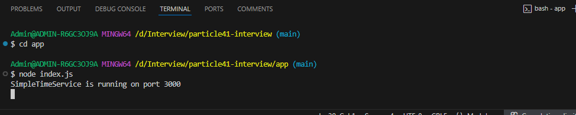

# particle41-interview
Partciel41 interview solution

# Author - Sree Satya Sitaram Narpareddi

The solution has been broken into 4 parts

* Write the application code in Nodejs using expressjs
* Create a Dockerfile to containerize the application
* Create terraform code to create required infrastructure
* Deploy the application to the EKS cluster and test the load balancer dns.

**Additionally screenshots have been added**

# Application code

* Created a folder app to store all the application code here
* Created an index.js file
* launch a terminal to install all the requirements for the application to run
* Run `npm init` -> this will instantiate the node package manager and create `package.json` file and this will store all the required application data.
* Run `npm install express` -> This will install the required dependencies for our application
* Once the application is ready, we can run the application locally to test the same.
* Run `node index.js` to start the application
* Check `localhost:3000`, we should be able to see the application

Pictures/Screenshots

# Containerizing the application